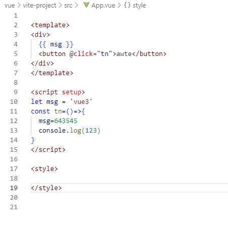

assets:静态资源
components：组件，公共组件（解耦合），常用组件
/*
router:路由，暂时未出现
store: vuex状态管理
views：页面，视图，正常的页面存储位置
*/暂未出现，疑似与新建方式有关系
APP.vue:根组件
main.js:入口

.gitignore:git忽略文件，有些文件不需要上传
bale.config.js:做兼容，把es6转es5，支持更多浏览器
package.json:项目依赖文件，类似pom.xml

展示数据：
v-html:将一个字符串解析为html表现，并渲染到模板中，主要用于渲染富文本内容，并且存在xss攻击风险
v-text:将数据绑定到模板中，它会替换目标元素的文本内容，防止xss攻击，会对html标签进行转义
v-once:一次渲染
v-model:双向数据绑定,常用在<input>,<texttarea>,<select>元素上创建双向数据绑定，将会忽略初始属性值，应在data中声明初始值//放属性或者侦听器
v-model.lazy 更改数据同步时机
.number 转化为数值类型
.trim 去除首尾空格
{{}}:最常用：渲染数据，会对html标签进行转义
computed适用于一些简单的情况
watch使用于一些比较复杂的情况，以及侦听的情况
方法和computed的区别
1、computed具有缓存机制，而且是一个属性
2、方法，属于一个函数需要调用实现

v-if , v-show效果类似
v-if写法类似ifelse
v-show隐藏的方式是不显示
v-if是直接销毁dom也就是语句，每次都会删除和重新创建
频繁切换用v-show反之v-if
v-for循环语句，用于显示列表,key值与虚拟dom有关

样式绑定style和:class

计算属性有一个缓存机制，计算属性不发生变化，计算属性就不会发生计算

.vue就是一个组件，相同的一个生命周期钩子，vue2与vue3的不同

组件传值：
1、父组件向子组件
2、子组件向父组件 emit：自定义事件

vue2的项目 npm create 项目名
打包工具：webpack

vue3的项目：基于vite来创建
打包工具：npm init vite@latest

vue3中不需要写this

ref里面可以是基本数据类型，也可以是复杂数据类型：object等
shallowRef如果改不了里面的值，可以使用triggerRef，triggerRef()进行修改
reactive只能定义复杂数据类型,用来定义数组，对象,不需要.value
shallowReative有可能不能更改对象内对象内容
reactive能行ref更行

=>函数与function的区别：
普通this指向外层第一个对象
function 函数名(){}
箭头函数的this指向在定义的时候就已经决定了，而且是不可修改的(不能有 call，apply，bind)，箭头函数的this指向定义的时候，外层第一个普通该函数的this
箭头函数是不可以new的，也不可以作为构造函数
箭头函数是没有prototype的
箭头函数是没有arguments的
看到部分没有return可能是省略，函数体只有一行，花括号也可以没有

slot：
    插槽：
        默认插槽
        每一个插入不同的：具名插槽
v-slot: => #